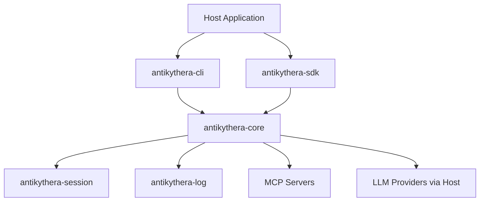

# Antikythera MCP Framework

Antikythera MCP Framework is a Rust workspace for building MCP-capable agent runtimes, host-integrated orchestration flows, and portable WASM agent components.

## System Overview



## What Is Included

- Stable workspace crates for CLI, SDK, core runtime, session, and logging.
- Multi-agent orchestration with guardrails, resilience, and observability hooks.
- Streaming support for token/event output and buffered delivery policies.
- WASM component integration path for host-controlled execution.
- Consolidated documentation under `documentation/`.

## Workspace Layout

- `antikythera-core`: core MCP protocol, transport layers, and agent runtime.
- `antikythera-sdk`: high-level API wrapper with FFI and WASM bindings.
- `antikythera-session`: session management with persistent chat history.
- `antikythera-storage`: session persistence with pluggable backends.
- `antikythera-log`: unified logging system and subscriber support.
- `antikythera-domain`: canonical domain types for the framework.
- `antikythera-ports`: port trait definitions (hexagonal architecture).
- `antikythera-config`: configuration schema and loading.
- `antikythera-resilience`: retry, timeout, context window, and health tracking.
- `antikythera-tooling`: MCP tool server management.
- `antikythera-streaming`: token/event streaming primitives.
- `antikythera-wasm-bindgen`: wasm-bindgen bindings for browser WASM targets.
- `example/antikythera-cli`: interactive and scripted CLI entry binaries.
- `tests`: workspace integration tests and scenario coverage.
- `scripts`: build-scripts crate for WIT validation and WASM component tooling.

## Build and Validate

```bash
cargo build --workspace
cargo test --workspace
cargo fmt --all -- --check
cargo clippy --workspace --lib --bins -- -D warnings -D deprecated
```

## Documentation Index

- [Architecture](documentation/ARCHITECTURE.md)
- [Build](documentation/BUILD.md)
- [Cache](documentation/CACHE.md)
- [CLI](documentation/CLI.md)
- [Component](documentation/COMPONENT.md)
- [Config](documentation/CONFIG.md)
- [Context Management](documentation/CONTEXT_MANAGEMENT.md)
- [Deprecation Policy](documentation/DEPRECATION_POLICY.md)
- [Guardrails](documentation/GUARDRAILS.md)
- [Hooks](documentation/HOOKS.md)
- [Import Export](documentation/IMPORT_EXPORT.md)
- [JSON Schema](documentation/JSON_SCHEMA.md)
- [Logging](documentation/LOGGING.md)
- [MCP Contracts](documentation/MCP_CONTRACTS.md)
- [Migration](documentation/MIGRATION.md)
- [Observability](documentation/OBSERVABILITY.md)
- [Product Scope](documentation/PRODUCT_SCOPE.md)
- [Resilience](documentation/RESILIENCE.md)
- [Security](documentation/SECURITY.md)
- [Servers and Agents](documentation/SERVERS_AND_AGENTS.md)
- [Streaming](documentation/STREAMING.md)
- [Testing](documentation/TESTING.md)
- [WASM Agent](documentation/WASM_AGENT.md)
- [Workspace](documentation/WORKSPACE.md)
