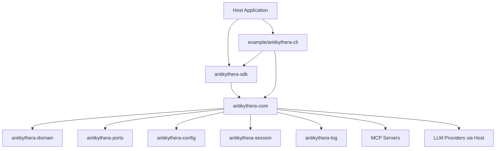

# Antikythera MCP Framework

Antikythera MCP Framework is a Rust workspace for building MCP-capable agent runtimes, host-integrated orchestration flows, and portable WASM agent components.

## System Overview



## What Is Included

- Modular workspace crates: domain, ports, config, resilience, log, session, storage, tooling, core, and SDK.
- Multi-agent orchestration with guardrails, resilience, and observability hooks.
- Streaming support for token/event output and buffered delivery policies.
- WASM component integration path for host-controlled execution.
- Example applications under `example/` (CLI client, web client).
- Consolidated documentation under `documentation/`.

## Workspace Layout

### Framework crates (workspace members)

| Crate | Role |
|:------|:-----|
| `antikythera-domain` | Canonical domain types (entities, sessions, FSM, validation) |
| `antikythera-ports` | Port trait definitions (hexagonal architecture) |
| `antikythera-config` | Configuration schema and loading |
| `antikythera-resilience` | Retry, timeout, context window, and health tracking |
| `antikythera-log` | Unified logging system and subscriber support |
| `antikythera-session` | Session management with persistent chat history |
| `antikythera-storage` | Session persistence with pluggable backends |
| `antikythera-tooling` | MCP tool server management |
| `antikythera-core` | Core MCP protocol, transport layers, and agent runtime |
| `antikythera-sdk` | High-level API wrapper with FFI and WASM bindings |
| `antikythera-wasm-bindgen` | wasm-bindgen bindings for browser WASM targets |

### Example applications (not workspace members)

| Path | Role |
|:-----|:-----|
| `example/antikythera-cli` | Interactive CLI client — reference implementation for building CLI hosts |
| `example/antikythera-web` | Web frontend (Vue.js/TypeScript) |

### Supporting directories

| Path | Role |
|:-----|:-----|
| `tests/` | Workspace integration tests and scenario coverage |
| `scripts/` | Build scripts for WIT validation and WASM component tooling |
| `documentation/` | Focused guides and references |

## Build and Validate

```bash
cargo build --workspace
cargo test --workspace
cargo fmt --all -- --check
cargo clippy --workspace --lib --bins -- -D warnings -D deprecated
```

## Documentation Index

### Framework

- [Architecture](documentation/ARCHITECTURE.md) — crate relationships and request flow
- [Workspace](documentation/WORKSPACE.md) — repository organization and crate responsibilities
- [Product Scope](documentation/PRODUCT_SCOPE.md) — deployment targets and feature flags
- [Build](documentation/BUILD.md) — build commands for each target
- [Config](documentation/CONFIG.md) — configuration format and loading
- [Component](documentation/COMPONENT.md) — WASM component model details

### Runtime

- [Servers and Agents](documentation/SERVERS_AND_AGENTS.md) — server and agent management
- [Streaming](documentation/STREAMING.md) — token/event streaming behavior
- [Resilience](documentation/RESILIENCE.md) — retry, timeout, and health tracking
- [Guardrails](documentation/GUARDRAILS.md) — runtime hardening controls
- [Hooks](documentation/HOOKS.md) — host integration hooks
- [Context Management](documentation/CONTEXT_MANAGEMENT.md) — context window management

### Reference

- [Logging](documentation/LOGGING.md) — structured logging system
- [Security](documentation/SECURITY.md) — input validation, rate limiting, secrets
- [Storage](documentation/STORAGE.md) — pluggable session persistence
- [Cache](documentation/CACHE.md) — caching layer details
- [Import Export](documentation/IMPORT_EXPORT.md) — backup and restore flows
- [JSON Schema](documentation/JSON_SCHEMA.md) — schema definitions
- [MCP Contracts](documentation/MCP_CONTRACTS.md) — MCP protocol contracts
- [Observability](documentation/OBSERVABILITY.md) — metrics and telemetry

### WASM

- [WASM Agent](documentation/WASM_AGENT.md) — agent logic inside the component
- [WASM Architecture](documentation/WASM_ARCHITECTURE.md) — WASM deployment architecture

### Example Implementations

- [CLI](documentation/CLI.md) — CLI client example (reference implementation)

### Process

- [Testing](documentation/TESTING.md) — test strategy and commands
- [Migration](documentation/MIGRATION.md) — documentation structure history
- [Deprecation Policy](documentation/DEPRECATION_POLICY.md) — deprecation lifecycle
