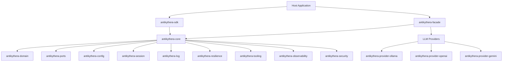

# Antikythera Agent SDK

Antikythera Agent SDK is a Rust workspace for building MCP-capable agent runtimes, host-integrated orchestration flows, and portable WASM agent components.

## Packages

| Platform | Package | Link |
|:---------|:--------|:-----|
| **npm** | `antikythera-agent` | [npmjs.com/package/antikythera-agent](https://www.npmjs.com/package/antikythera-agent) |
| **PyPI** | `antikythera-agent` | [pypi.org/project/antikythera-agent](https://pypi.org/project/antikythera-agent/) |

## System Overview



## What Is Included

- Modular workspace crates organized in 6 layers (types → implementations → core → providers → SDK/facade → deployment).
- Multi-provider LLM support: Ollama (default), OpenAI, and Gemini via feature-gated facade.
- Multi-agent orchestration with guardrails, resilience, and observability hooks.
- Streaming support for token/event output and buffered delivery policies.
- WASM component integration path for host-controlled execution (browser via WASI component + jco, WASI Component Model on the server, Wasmtime sandbox), plus a **Runtime Bridge** for client–server connectivity (Rust server host + JS client host, HTTP + SSE wire protocol).
- Consolidated documentation under `documentation/`.

## Workspace Layout

### Layer 0: Types

| Crate | Role |
|:------|:-----|
| `antikythera-domain` | Canonical domain types (entities, sessions, FSM, validation) — zero internal deps |
| `antikythera-ports` | Port trait definitions (hexagonal architecture) — depends on domain |

### Layer 1: Implementations

| Crate | Role |
|:------|:-----|
| `antikythera-config` | Configuration schema and loading — depends on domain |
| `antikythera-log` | Structured logging and subscriptions — standalone |
| `antikythera-resilience` | Retry, timeout, context window, and health tracking — depends on domain |
| `antikythera-tooling` | MCP tool server management — depends on domain, config |
| `antikythera-observability` | In-memory observability implementations — depends on domain, ports |
| `antikythera-security` | Validation, rate limiting, secrets management — depends on domain, ports |
| `antikythera-storage` | Session persistence with pluggable backends — depends on domain |

### Layer 2: Core

| Crate | Role |
|:------|:-----|
| `antikythera-core` | Core MCP runtime, agent logic, transports — depends on domain, ports, config, log, resilience, tooling, observability |
| `antikythera-session` | Session management with persistent chat history — depends on domain, log |

### Layer 3: Providers

| Crate | Role |
|:------|:-----|
| `antikythera-provider-ollama` | Ollama LLM provider — depends on domain, core |
| `antikythera-provider-openai` | OpenAI LLM provider — depends on domain, core |
| `antikythera-provider-gemini` | Google Gemini LLM provider — depends on domain, core |

### Layer 4: SDK & Facade

| Crate | Role |
|:------|:-----|
| `antikythera-sdk` | Public API layer for Rust and WASM component bindings — depends on core, log, session |
| `antikythera-facade` | High-level API with provider selection (Ollama/OpenAI/Gemini) — depends on core, domain, log |

### Layer 5: Deployment

| Crate | Role |
|:------|:-----|
| `plugin/antikythera-wasm-bindgen` | **Legacy** wasm-bindgen browser glue (`wasm32-unknown-unknown`) — digantikan jalur WASI component + jco; dipertahankan untuk kompatibilitas — depends on SDK |
| `plugin/antikythera-toolrunner` | In-process tool execution and standalone WASM tool-registry component (composed into the SDK deliverable) |
| `plugin/antikythera-default-hooks` | Default no-op logic-hooks implementation (composed into the SDK deliverable) |
| `antikythera-server-runtime` | Server host runtime for the WASM composite — wasmtime core + HTTP/SSE wire bridge (lib + bin) |

### Supporting directories

| Path | Role |
|:-----|:-----|
| `tests/` | Workspace integration tests and scenario coverage |
| `scripts/` | WIT generation and component build helpers |
| `documentation/` | Focused guides and references |

### Examples

| Path | Role |
|:-----|:-----|
| `examples/chat` | Rust chat example using antikythera-facade |
| `examples/antikythera-web` | TypeScript/Vite web frontend using the client host runtime (`antikythera-agent/runtime`) (not a workspace member) |
| `examples/component-harness` | Wasmtime server proof: composite verification, logic-hooks/logic-core/host-imports probes, runtime-hooks probes |
| `examples/logic-hooks-template` | Host-authored logic-hooks component template (composed in place of default-hooks) |
| `examples/logic-hooks-example` | Filled-in logic-hooks probe (`decide-action` forces `action=final`) |
| `examples/logic-core-template` | Drop-in runner template (world logic-core-component) |
| `examples/logic-core-example` | Deterministic drop-in logic core (echo-agent) + swap proof |
| `examples/logic-core-host-example` | Full custom loop via host-imports (call-llm/save/load/emit-tool-call/log) + permission-gated host implementations |

## Build and Validate

```bash
cargo build --workspace
cargo test --workspace
cargo fmt --all -- --check
cargo clippy --workspace --lib --bins -- -D warnings -D deprecated
```

## Documentation Index

### Framework

- [Architecture](documentation/ARCHITECTURE.md) — crate relationships and request flow
- [Workspace](documentation/WORKSPACE.md) — repository organization and crate responsibilities
- [Product Scope](documentation/PRODUCT_SCOPE.md) — deployment targets and feature flags
- [Build](documentation/BUILD.md) — build commands for each target
- [Config](documentation/CONFIG.md) — configuration format and loading
- [Component](documentation/COMPONENT.md) — WASM component model details

### Runtime

- [Servers and Agents](documentation/SERVERS_AND_AGENTS.md) — server and agent management
- [Streaming](documentation/STREAMING.md) — token/event streaming behavior
- [Resilience](documentation/RESILIENCE.md) — retry, timeout, and health tracking
- [Guardrails](documentation/GUARDRAILS.md) — runtime hardening controls
- [Hooks](documentation/HOOKS.md) — host integration hooks
- [Context Management](documentation/CONTEXT_MANAGEMENT.md) — context window management

### Reference

- [Logging](documentation/LOGGING.md) — structured logging system
- [Security](documentation/SECURITY.md) — input validation, rate limiting, secrets
- [Storage](documentation/STORAGE.md) — pluggable session persistence
- [Cache](documentation/CACHE.md) — caching layer details
- [Import Export](documentation/IMPORT_EXPORT.md) — backup and restore flows
- [JSON Schema](documentation/JSON_SCHEMA.md) — schema definitions
- [MCP Contracts](documentation/MCP_CONTRACTS.md) — MCP protocol contracts
- [Observability](documentation/OBSERVABILITY.md) — metrics and telemetry

### WASM

- [WASM Agent](documentation/WASM_AGENT.md) — agent logic inside the component
- [WASM Architecture](documentation/WASM_ARCHITECTURE.md) — WASM deployment architecture
- [Wire Protocol](documentation/WIRE_PROTOCOL.md) — Runtime Bridge HTTP + SSE wire contract
- [Runtime Bridge Decisions](documentation/DECISIONS_RUNTIME_BRIDGE.md) — Runtime Bridge design decision register

### Process

- [Testing](documentation/TESTING.md) — test strategy and commands
- [Migration](documentation/MIGRATION.md) — documentation structure history
- [Deprecation Policy](documentation/DEPRECATION_POLICY.md) — deprecation lifecycle
