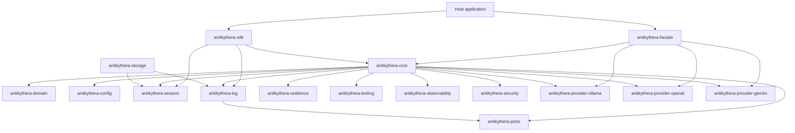
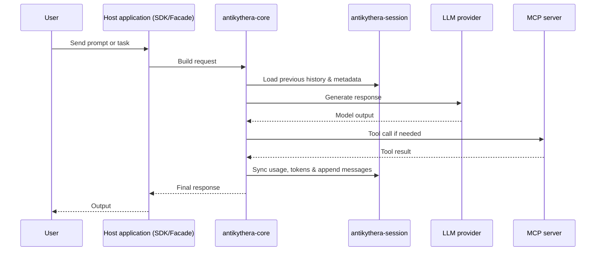

# Architecture

This document gives a current high-level view of how the workspace crates interact.

## System view

## Core Principles

- **Single Source of Truth for Session:** `antikythera-session` owns the conversational data model (`Message`, `MessageRole`, `MessagePart`) and provides the thread-safe `SessionManager`. Both `CORE` (for actual context injection) and host applications utilize this unified model.
- **Pluggable Persistence:** `antikythera-storage` provides session persistence with pluggable backends (filesystem, MongoDB, PostgreSQL), in-memory caching with TTL/LRU eviction, and backup coordination. Host applications integrate storage via the `--storage` flag or direct API.
- **Stateless Tooling:** `CORE` orchestrates LLM dispatch, agent loops, and MCP tools, delegating long-term conversational memory to `SESSION` and `STORAGE`.
- **Provider Abstraction:** LLM providers (Ollama, OpenAI, Gemini) implement the `ModelProvider` port trait from `antikythera-ports`. The `antikythera-facade` crate provides a unified API with feature-gated provider selection.
- **Security Layer:** `antikythera-security` provides input validation, rate limiting, and secrets management. Port traits are defined in `antikythera-ports`, with concrete implementations in the security crate.
- **Observability Layer:** `antikythera-observability` provides in-memory metrics, audit trails, and tracing hooks. Port traits are defined in `antikythera-ports`, with concrete implementations in the observability crate.
- **FFI & Portability:** `SDK` exposes `SESSION` and `LOG` components over safe FFI boundaries, allowing host languages (e.g. Node.js, Python) to import/export chat histories easily using JSON format.

## Request flow

## Crate reading order

1. `antikythera-domain` — canonical domain types (start here).
2. `antikythera-ports` — port/adapter trait definitions.
3. `antikythera-config` — configuration schema and loading.
4. `antikythera-log` — unified logging infrastructure.
5. `antikythera-resilience` — retry policies, health tracking, context window management.
6. `antikythera-tooling` — MCP tool server management.
7. `antikythera-observability` — in-memory observability implementations.
8. `antikythera-security` — input validation, rate limiting, secrets management.
9. `antikythera-session` — session management and chat history.
10. `antikythera-storage` — pluggable session persistence.
11. `antikythera-core` — application layer: protocol, transport, orchestration, streaming (depends on all above).
12. `antikythera-sdk` — SDK/integration surface (FFI boundaries, WASM bindings).
13. `antikythera-facade` — high-level API with provider selection (Ollama/OpenAI/Gemini).

Example applications:
- `examples/chat` — Rust chat example using antikythera-facade.
- `examples/antikythera-web` — Web frontend (TypeScript/Vite).

Supporting crates:
- `antikythera-wasm-bindgen` — **legacy** wasm-bindgen bindings for browser targets (deprecated; digantikan jalur WASI component + jco).
- `antikythera-toolrunner` — in-process tool execution.

> **Note:** `antikythera-core/src/domain/` and `antikythera-core/src/application/ports/` are now thin re-exports from the `antikythera-domain` and `antikythera-ports` crates respectively. The canonical definitions live in those crates.
