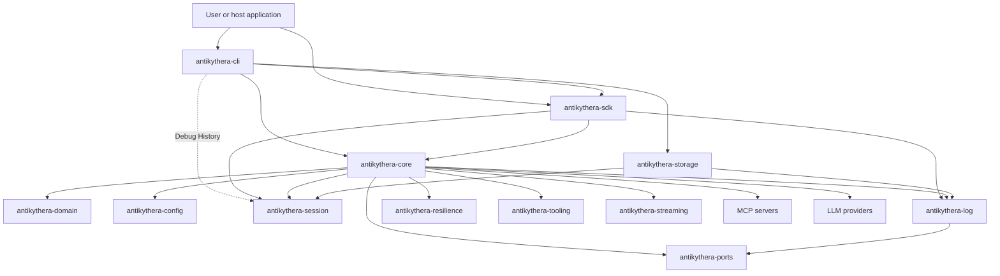
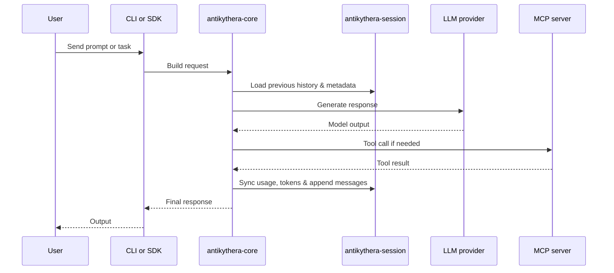

# Architecture

This document gives a current high-level view of how the main crates interact.

## System view

## Core Principles

- **Single Source of Truth for Session:** `antikythera-session` owns the conversational data model (`Message`, `MessageRole`, `MessagePart`) and provides the thread-safe `SessionManager`. Both `CORE` (for actual context injection) and `CLI` (for debug persistence) utilize this unified model.
- **Pluggable Persistence:** `antikythera-storage` provides session persistence with pluggable backends (filesystem, MongoDB, PostgreSQL), in-memory caching with TTL/LRU eviction, and backup coordination. The `--storage` flag in CLI enables automatic session persistence.
- **Stateless Tooling:** `CORE` orchestrates LLM dispatch, agent loops, and MCP tools, delegating long-term conversational memory to `SESSION` and `STORAGE`.
- **FFI & Portability:** `SDK` exposes `SESSION` and `LOG` components over safe FFI boundaries, allowing host languages (e.g. Node.js, Python) to import/export chat histories easily using the `Postcard` binary format.

## Request flow

## Crate reading order

1. `antikythera-domain` — canonical domain types (start here).
2. `antikythera-ports` — port/adapter trait definitions.
3. `antikythera-config` — configuration schema and loading.
4. `antikythera-log` — unified logging infrastructure.
5. `antikythera-core` — application layer: protocol, transport, orchestration, resilience, streaming (depends on domain, ports, config, log).
6. `antikythera-sdk` — SDK/integration surface (FFI boundaries, WASM bindings).
7. `example/antikythera-cli` — user-facing binary.

Supporting crates:
- `antikythera-session` — session management and chat history.
- `antikythera-storage` — pluggable session persistence.
- `antikythera-resilience` — retry policies, health tracking, context window management.
- `antikythera-tooling` — MCP tool server management.
- `antikythera-streaming` — token/event streaming primitives.
- `antikythera-wasm-bindgen` — wasm-bindgen bindings for browser targets.

> **Note:** `antikythera-core/src/domain/` and `antikythera-core/src/application/ports/` are now thin re-exports from the `antikythera-domain` and `antikythera-ports` crates respectively. The canonical definitions live in those crates.
