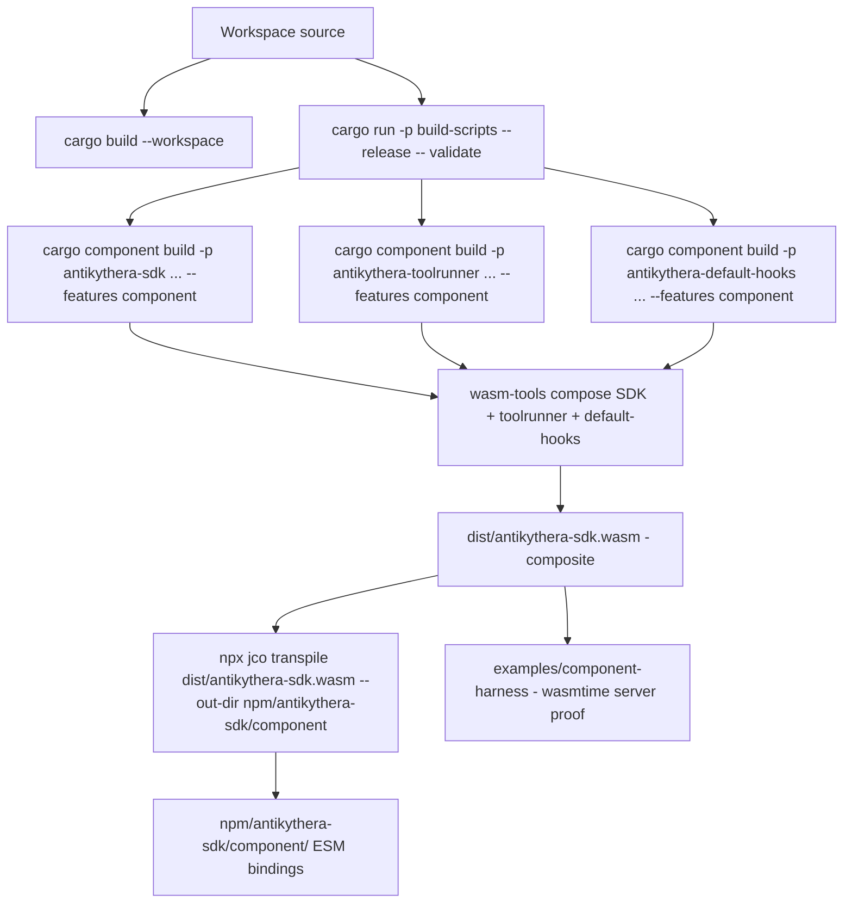
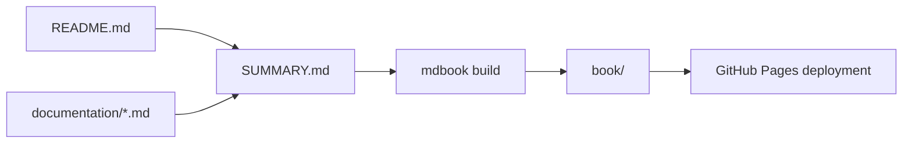
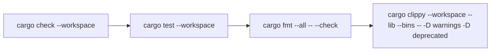

# BUILD

This guide covers the commands that match the current workspace layout and tooling.

## Build map



## What you can build

| Target | Status | Notes |
|:-------|:------:|:------|
| Workspace crates | ✅ | `cargo build --workspace` — all framework crates + tests + scripts |
| `antikythera-sdk` component | ✅ | Standalone intermediate via `cargo-component` + `wasm32-wasip1` (feature `component`); imports `tool-registry` + `logic-hooks` — **not** a consumable deliverable |
| `antikythera-toolrunner` component | ✅ | Standalone intermediate via `cargo-component` + `wasm32-wasip1` (feature `component`); exports `tool-registry` (builtin tools) |
| `antikythera-default-hooks` component | ✅ | Standalone intermediate via `cargo-component` + `wasm32-wasip1` (feature `component`); exports `logic-hooks` (no-op passthrough) |
| **Composite WASM deliverable** | ✅ | `wasm-tools compose` SDK + toolrunner + default-hooks → `dist/antikythera-sdk.wasm` (imports only WASI, exports `runner`) |
| Browser JS bindings | ✅ | `jco transpile` of the **composite** → `npm/antikythera-sdk/component/` (ESM, namespace `runner`) |

## Prerequisites

- recent stable Rust toolchain (edition 2024)
- `cargo-component` for component builds
- `wasm-tools` for composing the SDK, toolrunner, and hooks components
- Node.js with ESM support and `@bytecodealliance/jco` (installed at repo root; the version pinned in the root package.json) for the browser JS bindings
- Optional: `task` for the helpers in `Taskfile.yml`

## Native builds

### Build all workspace crates

```bash
cargo build --workspace
```

### Build release artifacts

```bash
cargo build --workspace --release
```

## WASM component build

### Validate WIT

```bash
cargo run -p build-scripts --release -- validate
```

This validates the checked-in WIT file against Rust source types.

### Build the composite WASM component

The WASM deliverable is **composite** (three members): the SDK component imports `tool-registry` and `logic-hooks`; the toolrunner component exports `tool-registry`; the default-hooks component exports `logic-hooks` (no-op passthrough). `wasm-tools compose` wires all three. Build the three components, then compose:

```bash
cargo component build -p antikythera-sdk --release --target wasm32-wasip1 \
  --no-default-features --features component
cargo component build -p antikythera-toolrunner --release --target wasm32-wasip1 \
  --no-default-features --features component
cargo component build -p antikythera-default-hooks --release --target wasm32-wasip1 \
  --no-default-features --features component
```

The helper binary in `scripts/build-component.rs` validates WIT conformance against Rust source types.

Expected component output is produced under:

```text
target/wasm32-wasip1/release/
```

Compose into the canonical composite artifact (the component artifacts are copied to kebab-case names first because `wasm-tools compose` rejects underscores):

```bash
mkdir -p dist
cp target/wasm32-wasip1/release/antikythera_toolrunner.wasm \
  target/wasm32-wasip1/release/antikythera-toolrunner.wasm
cp target/wasm32-wasip1/release/antikythera_default_hooks.wasm \
  target/wasm32-wasip1/release/antikythera-default-hooks.wasm
wasm-tools compose target/wasm32-wasip1/release/antikythera_sdk.wasm \
  -d target/wasm32-wasip1/release/antikythera-toolrunner.wasm \
  -d target/wasm32-wasip1/release/antikythera-default-hooks.wasm \
  -o dist/antikythera-sdk.wasm
```

Canonical artifact name for CI/release packaging:

```text
dist/antikythera-sdk.wasm
```

`task compose` wraps the copy + compose steps (and depends on the component builds); `task build` runs the full composite build (WIT validation + all three components + compose).

> **Never transpile or embed the standalone SDK component.** `target/wasm32-wasip1/release/antikythera_sdk.wasm` still imports `tool-registry` and `logic-hooks`; jco transpilation of it yields a module with unmet imports that fails Node smoke tests. Always consume the composite.

### Verify the composite server-side

`examples/component-harness` is a wasmtime server binary that loads a component path (default `dist/antikythera-sdk.wasm`) and proves the builtin tool `echo` executes inside the composite with no host round-trip:

```bash
cargo run -p component-harness --release
```

Pass a custom hooks component and `--expect=final` to prove a host-authored `decide-action` override forces `action=final` and no tool executes:

```bash
cargo run -p component-harness --release -- <custom-hooks>.wasm --expect=final
```

### Host-authored logic hooks

The composite calls three plug-and-play pipeline hooks (`prepare-turn`, `decide-action`, `handle-tool-result`); the default composite embeds `plugin/antikythera-default-hooks`, a no-op passthrough provider. To customize pipeline decisions without changing the SDK, author a hooks component from the template `examples/logic-hooks-template/`:

- Edit only the three `custom_*` functions in `src/lib.rs` (`custom_prepare_turn`, `custom_decide_action`, `custom_handle_tool_result`). `None` = passthrough (SDK default); `Some(json)` = override. To abort the operation (Err-path), return an error from the matching `Guest` method in `component.rs`.
- Build the component:

```bash
cargo component build -p logic-hooks-template --release --target wasm32-wasip1 \
  --no-default-features --features component
```

- Compose it into the SDK in place of the default-hooks member (`wasm-tools compose ... -d <hooks>.wasm`; `task compose-hooks-custom` wraps this flow). The artifact exports `antikythera:agent-sdk/logic-hooks`.
- Verify with the harness (`--expect=final`):

```bash
cargo run -p component-harness --release -- <hooks>.wasm --expect=final
```

`examples/logic-hooks-example/` is a filled-in probe: its `decide-action` always returns `{"action":"final","content":"hook-forced-final"}`, so the harness `--expect=final` mode asserts the committed action is `final` and no tool executes. See [`WASM_ARCHITECTURE.md`](WASM_ARCHITECTURE.md) — Logic hooks for the full contract (hook points, passthrough/override/fail-closed semantics, state ownership).

### Authoring a drop-in logic core

The deepest customization is replacing the runner itself. A host-authored logic core that exports the same `runner` contract (world `logic-core-component` — the same 16 functions, the same JSON-string semantics) loads wherever the SDK composite loads, with zero host code changes. See [`WASM_ARCHITECTURE.md`](WASM_ARCHITECTURE.md) — Drop-in logic core (swap-able runner) for the contract, the optional `host-imports` / `tool-registry` imports, and the pruning rule.

Start from the template `examples/logic-core-template/`:

- Edit only the 14 `custom_*` functions in `src/lib.rs` (one per runner function except `get-state` / `reset-session`, which are fixed in-memory store plumbing). `None` = template default: `init` / `get-state` / `reset-session` work out of the box; every other runner function returns the structured error `{"error":"not implemented","function":"<kebab-case-name>"}`.
- Build the component. The logic core is consumed directly as a standalone artifact — it is never composed into `dist/`:

```bash
task build-logic-core-template
# or, for the filled-in probe:
task build-logic-core-example
```

(The tasks wrap `cargo component build -p logic-core-template|logic-core-example --release --target wasm32-wasip1 --no-default-features --features component`; artifacts land under `target/wasm32-wasip1/release/` — `logic_core_template.wasm` / `logic_core_example.wasm`. Unlike the composite members, no kebab-case copy is needed: the logic core is never composed.)

- Verify server-side with the harness final probe:

```bash
cargo run -p component-harness --release -- <logic-core>.wasm --expect=final --expect-content=echo-agent-done
```

`examples/logic-core-example/` is a deterministic "echo-agent": its commit always returns `{"action":"final","content":"echo-agent-done",...}`, so the command above asserts the committed action is `final` with that content and no tool executes. Use `--expect=notimpl` to probe template holes and assert the structured not-implemented error.

- Verify client-side: because a self-contained logic core imports only WASI, it transpiles with jco like the composite does (same WASI stub mapping, see the transpile section below) and runs in the Node probe and the Vite bundle.

### Transpile the composite to browser JS bindings (jco)

The browser path reuses the **composite** WASI component and transpiles it to browser-safe ESM with `@bytecodealliance/jco`. Run `task compose` first (or `task transpile`, which depends on `compose`):

```bash
npx jco transpile dist/antikythera-sdk.wasm --out-dir npm/antikythera-sdk/component \
  -M wasi:cli/environment=./wasi-stubs/environment.js \
  -M wasi:cli/exit=./wasi-stubs/exit.js \
  -M wasi:cli/stderr=./wasi-stubs/stderr.js \
  -M wasi:cli/stdin=./wasi-stubs/stdin.js \
  -M wasi:cli/stdout=./wasi-stubs/stdout.js \
  -M wasi:clocks/monotonic-clock=./wasi-stubs/monotonic-clock.js \
  -M wasi:clocks/wall-clock=./wasi-stubs/wall-clock.js \
  -M wasi:filesystem/preopens=./wasi-stubs/preopens.js \
  -M wasi:filesystem/types=./wasi-stubs/types.js \
  -M wasi:io/error=./wasi-stubs/error.js \
  -M wasi:io/streams=./wasi-stubs/streams.js \
  -M wasi:random/random=./wasi-stubs/random.js
```

The 12 `-M` flags map every WASI import (cli, io, clocks, filesystem, random) to a browser-safe stub under `npm/antikythera-sdk/component/wasi-stubs/`. A `transpile` task is available in `Taskfile.yml` as a shortcut.

Consume from JS as:

```javascript
import { runner } from 'antikythera-agent/component';
const sessionId = runner.init(JSON.stringify({ session_id: 's1' }));
```

See [`WASM_ARCHITECTURE.md`](WASM_ARCHITECTURE.md) for the full `runner` contract and jco pitfalls (jco has no `--dts`; ES2022 target required for top-level await).

## Docs site build

The repository also includes an `mdBook` configuration that turns `README.md` plus the `documentation/` folder into a static documentation site.



### Local commands

```bash
# Build static site
mdbook build

# Preview locally
mdbook serve --open
```

## Tests and quality checks

### Verification flow



### Workspace-wide

```bash
cargo test --workspace
cargo fmt --all -- --check
cargo clippy --workspace --lib --bins -- -D warnings -D deprecated
```

### Common targeted checks

```bash
# SDK library tests
cargo test -p antikythera-sdk --lib

# Check all workspace crates without producing binaries
cargo check --workspace
```

## Taskfile helpers

The repository includes `Taskfile.yml` for common flows.

| Task | Purpose |
|:-----|:--------|
| `task build` | Build the composite WASM component (SDK + toolrunner + default-hooks + compose) |
| `task build-wasm-harness` | Build the standalone SDK WASM artifact (intermediate) |
| `task build-toolrunner` | Build the standalone toolrunner WASM artifact (intermediate) |
| `task compose` | Compose SDK + toolrunner + default-hooks into `dist/antikythera-sdk.wasm` |
| `task compose-hooks-custom` | Compose SDK + toolrunner with a host-authored logic-hooks component in place of default-hooks |
| `task build-all` | Build all WASM artifacts (standalone SDK + toolrunner + default-hooks + composite) |
| `task wit` | Validate WIT conformance |
| `task transpile` | Transpile the **composite** to JS bindings with jco (depends on `compose`) |
| `task transpile-clean` | Remove transpiled JS output directory |
| `task test` | Run workspace tests |
| `task test-sdk` | Run SDK tests |
| `task test-ffi` | Run FFI tests |
| `task test-component` | Run component tests |
| `task check` | Run `cargo check --workspace` |
| `task check-wasm` | Check WASM compilation |
| `task lint` | Run Clippy |
| `task format` | Run rustfmt |
| `task inspect` | Inspect the built component with `wasm-tools` if installed |
| `task size` | Show binary sizes |
| `task clean` | Clean all build artifacts |
| `task clean-wasm` | Clean WASM build artifacts |

## Notes

- The composite build (`wasm32-wasip1`, feature `component` on all three crates, then `wasm-tools compose`) is the WASM deployment target for both server and browser. Use `dist/antikythera-sdk.wasm` when embedding agent logic in a host application via wasmtime (`examples/component-harness` proves the builtin tool path), and transpile the composite with jco for browser consumption.
- The standalone `antikythera-sdk` component is an intermediate artifact: it imports `tool-registry` and `logic-hooks` and must be composed with `antikythera-toolrunner` and a hooks provider (default: `antikythera-default-hooks`) before any consumer (wasmtime harness, jco) touches it.
- The legacy wasm-bindgen path (`wasm32-unknown-unknown` + `wasm` feature, `plugin/antikythera-wasm-bindgen`, wasm-pack) is **deprecated**; it is kept only for crate-level compatibility during the transition. Do not use it for new browser integrations.
