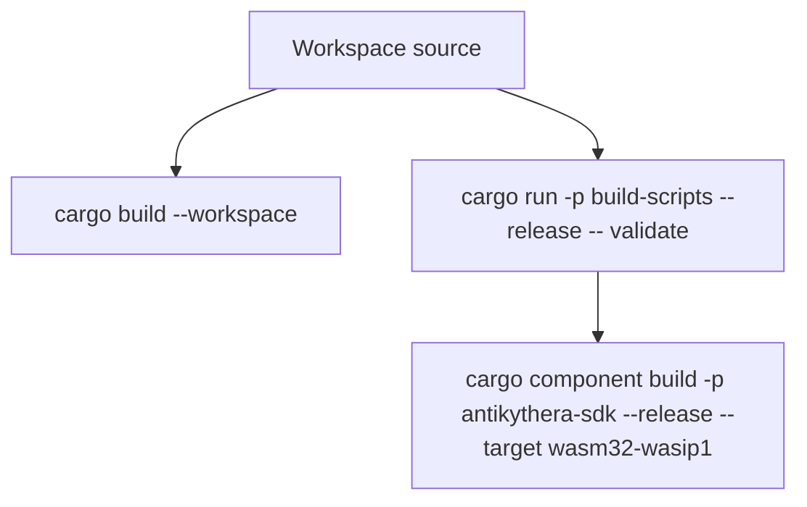
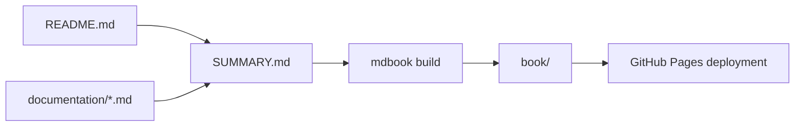
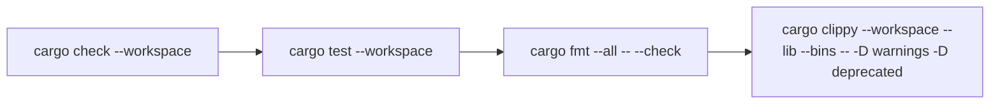

# BUILD

This guide covers the commands that match the current workspace layout and tooling.

## Build map



## What you can build

| Target | Status | Notes |
|:-------|:------:|:------|
| Workspace crates | ✅ | `cargo build --workspace` — all framework crates + tests + scripts |
| `antikythera-sdk` component build | ✅ | Single WASM output via `cargo-component` + `wasm32-wasip1` |

## Prerequisites

- Rust 1.85+
- `cargo-component` for component builds
- Optional: `wasm-tools` for inspecting the generated component
- Optional: `task` for the helpers in `Taskfile.yml`

## Native builds

### Build all workspace crates

```bash
cargo build --workspace
```

### Build release artifacts

```bash
cargo build --workspace --release
```

## WASM component build

### Validate WIT

```bash
cargo run -p build-scripts --release -- validate
```

This validates the checked-in WIT file against Rust source types.

### Build the WASM component

```bash
cargo component build -p antikythera-sdk --release --target wasm32-wasip1 \
  --no-default-features --features component
```

The helper binary in `scripts/build-component.rs` validates WIT conformance against Rust source types.

Expected component output is produced under:

```text
target/wasm32-wasip1/release/
```

Canonical artifact name for CI/release packaging:

```text
dist/antikythera-sdk.wasm
```

## Docs site build

The repository also includes an `mdBook` configuration that turns `README.md` plus the `documentation/` folder into a static documentation site.



### Local commands

```bash
# Build static site
mdbook build

# Preview locally
mdbook serve --open
```

## Tests and quality checks

### Verification flow



### Workspace-wide

```bash
cargo test --workspace
cargo fmt --all -- --check
cargo clippy --workspace --lib --bins -- -D warnings -D deprecated
```

### Common targeted checks

```bash
# SDK library tests
cargo test -p antikythera-sdk --lib

# Check all workspace crates without producing binaries
cargo check --workspace
```

## Taskfile helpers

The repository includes `Taskfile.yml` for common flows.

| Task | Purpose |
|:-----|:--------|
| `task build` | Build the WASM component |
| `task build-wasm-harness` | Build WASM artifact for FFI host harness |
| `task build-all` | Build all WASM artifacts |
| `task wit` | Validate WIT conformance |
| `task test` | Run workspace tests |
| `task test-sdk` | Run SDK tests |
| `task test-ffi` | Run FFI tests |
| `task test-component` | Run component tests |
| `task check` | Run `cargo check --workspace` |
| `task check-wasm` | Check WASM compilation |
| `task lint` | Run Clippy |
| `task format` | Run rustfmt |
| `task inspect` | Inspect the built component with `wasm-tools` if installed |
| `task size` | Show binary sizes |
| `task clean` | Clean all build artifacts |
| `task clean-wasm` | Clean WASM build artifacts |

## Notes

- The component build (`wasm32-wasip1`) is the WASM deployment target. Use it when embedding agent logic in a host application via wasmtime.
- For browser or C FFI targets, implement those in the host application itself — the framework does not provide those bindings.
