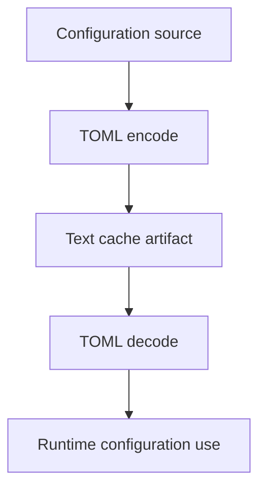

# Cache

This document describes the active cache model for configuration data.

## Cache Lifecycle

## Current Behavior

- Configuration artifacts are stored as TOML text for human readability.
- Cache decoding is tied to active schema compatibility checks.
- Runtime uses cache artifacts only when integrity checks pass.

## Operational Guidance

- Rebuild cache after schema-affecting updates.
- Keep import/export procedures aligned with cache format expectations.
