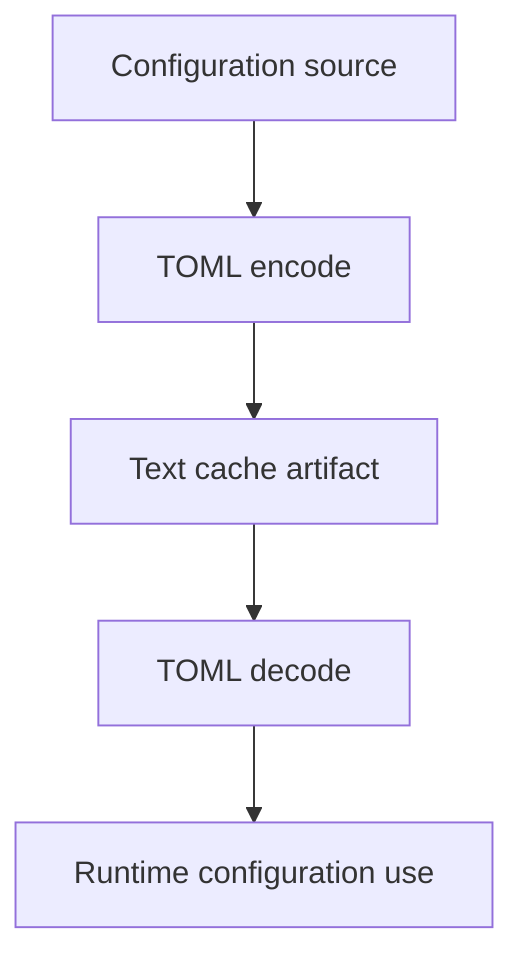
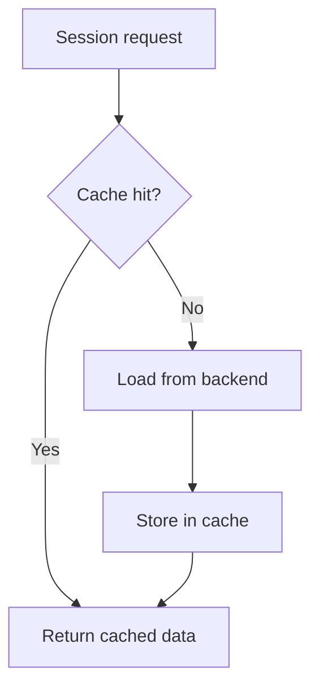

# Cache

This document describes the cache models used in the workspace.

## Configuration Cache

The configuration cache stores TOML config data for fast access:



## Session Cache (antikythera-storage)

The storage layer includes an in-memory session cache with configurable eviction:

| Feature | Description |
|:--------|:------------|
| TTL | Sessions expire after configurable idle time |
| LRU | Least-recently-used eviction when capacity reached |
| Dirty tracking | Modified sessions flagged for backup |
| On-demand loading | Sessions loaded from backend only when accessed |



### Cache configuration

```toml
[storage.cache]
enabled = true
max_sessions = 512
ttl_seconds = 3600
eviction_policy = "both"  # lru | ttl | both
```

## Operational Guidance

- Rebuild config cache after schema-affecting updates.
- Keep import/export procedures aligned with cache format expectations.
- For session cache, tune `max_sessions` based on available RAM and active session count.
