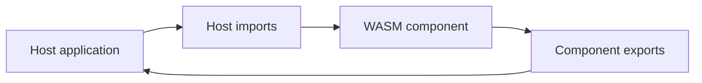
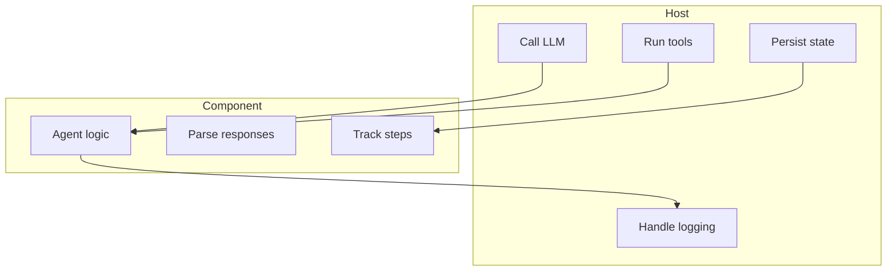

# Component

This document explains the WASM component model used by the project documentation.

## Overview

The component model keeps agent logic inside the component and pushes environment-specific I/O into the host.

The same component is the basis for both active WASM paths: the server embeds it via wasmtime, and the browser consumes it after `jco` transpiles it to ESM bindings (`clients/npm/antikythera-sdk/component/`, namespace `runner`). See [`WASM_ARCHITECTURE.md`](WASM_ARCHITECTURE.md) for the target/feature/build matrix.

## Component view

## Responsibility model

## Host-driven message flow

The component does not call model APIs directly. The intended flow is:

1. Host sends the initial user prompt into the framework or component.
2. Framework/WASM assigns `session_id`, builds the full message list, and preserves history/context.
3. Host receives the prepared message payload and performs the actual LLM API call.
4. Host may return either plain text or a fully shaped assistant message.
5. Framework/WASM commits that response back into session history so later turns stay connected to the same context.

This means the first incoming turn may be plain text only. Once a session exists, later turns should be sent with the matching `session_id` and any host-level metadata needed to keep the conversation aligned with the WASM state.

## Pipeline customization via logic-hooks

The pipeline can be customized with host-authored `logic-hooks` components (composed into the SDK, see [`WASM_ARCHITECTURE.md`](WASM_ARCHITECTURE.md)) without changing the SDK. Hooks are decision points (`prepare-turn`, `decide-action`, `handle-tool-result`) that can passthrough, override, or abort. Session state remains owned by the SDK: hooks are stateless and never persist.

## Runner replacement via a drop-in logic core

Beyond composing hooks, the host can replace the runner itself. A host-authored logic core that exports the same `runner` interface (world `logic-core-component`) loads wherever the SDK composite loads, with zero host code changes — the exported runner is identical to the SDK runner (the same 16 functions, the same JSON-string semantics), so the host calls the same API in both cases. `examples/logic-core-template/` is the starting point; `examples/logic-core-example/` proves the swap, and `examples/logic-core-host-example/` runs a full custom loop through the `host-imports` escape hatch (the component calls the host for LLM, state, and tool execution). See [`WASM_ARCHITECTURE.md`](WASM_ARCHITECTURE.md) — Drop-in logic core (swap-able runner) and [`BUILD.md`](BUILD.md) — Authoring a drop-in logic core.

## Hybrid host model

The SDK composite stays **host-push**: the host drives `runner` calls and feeds tool results back through `process-tool-result-for-session`; it never imports `host-imports`. A drop-in logic core may switch to **host-pull** by importing `host-imports` (`call-llm`, `save-state`, `load-state`, `emit-tool-call`, `log-message`) — the component then calls the host for LLM, state, tool execution, and logging. The two models coexist: host-push for the SDK composite, host-pull for logic cores that choose the escape hatch.

The escape hatch is permission-gated by the host. A host that wires `host-imports` MUST implement it behind permission gates (call-llm quota, emit-tool-call allowlist, bounded state storage, log passthrough) and reject anything outside the grant — without permission the component is rejected (fail-closed). `examples/logic-core-host-example/` proves the host-pull loop; `src/examples/component-harness` proves the gated host (`--probe=full-loop|quota|allowlist|storage`). See [`WASM_ARCHITECTURE.md`](WASM_ARCHITECTURE.md) — Host-imports (activated for drop-in logic cores) and [`BUILD.md`](BUILD.md) — Host-imports wiring.

## Why this design is useful

| Benefit | Explanation |
|:--------|:------------|
| Portability | The same component can run in different hosts |
| Separation of concerns | Runtime integration stays outside the component |
| Better host control | Providers, tools, and storage remain host-managed |

## Related documents

- [`WASM_AGENT.md`](WASM_AGENT.md)
- [`BUILD.md`](BUILD.md)
