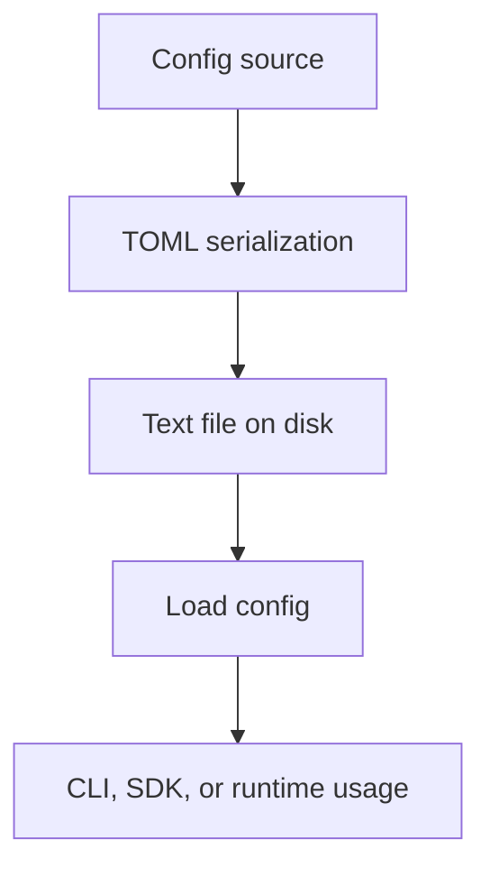

# Config

This document describes the TOML-based configuration flow used by the current documentation set and related SDK surfaces.

## Overview

The repository documents two configuration stories:

1. The lightweight CLI config flow built around `app.toml` (implemented in the example CLI at `example/antikythera-cli/`)
2. Broader SDK and core configuration helpers that use serialized configuration data

## Configuration model



## Why TOML

| Property | Benefit |
|:---------|:--------|
| Text format | Human-readable and editable in any text editor |
| Standard format | Widely supported across languages and tools |
| Typed serialization | Matches Rust data structures directly |
| Easy export/import | Works well for backup and transfer flows |

## Main points

- Configuration is treated as structured data first, not hand-edited prose.
- Export and inspection can still be done through JSON-based helper commands or APIs.
- Secrets should remain outside the config file when a dedicated secret mechanism is available.

## Storage configuration

The `[storage]` section in `app.toml` configures session persistence:

```toml
[storage]
backend = "filesystem"      # filesystem | mongodb | postgres
data_dir = "./data/sessions"
backup_dir = "./data/backups"
mode = "embedded"           # embedded | standalone

[storage.cache]
enabled = true
max_sessions = 512
ttl_seconds = 3600
eviction_policy = "both"    # lru | ttl | both

[storage.backup]
enabled = true
mode = "realtime"           # realtime | interval
sync_interval_seconds = 30
verify_before_delete = true

[storage.postgres]
host = "localhost"
port = 5432
database = "antikythera"
user = "postgres"
password = ""
auto_create_schema = true

[storage.mongodb]
uri = "mongodb://localhost:27017"
database = "antikythera"
collection = "sessions"
auto_create_schema = true

[storage.sse_backup]
enabled = false
bind = "0.0.0.0:8081"
core_url = "http://127.0.0.1:8080"
```

Enable storage initialization with the `--storage` flag when running a host application:

```bash
# Example CLI
antikythera --storage
```

## Related documents

- [`CLI.md`](CLI.md) for the example CLI config workflow
- [`STORAGE.md`](STORAGE.md) for storage backend details
- [`IMPORT_EXPORT.md`](IMPORT_EXPORT.md) for backup and restore flows
- [`CACHE.md`](CACHE.md) for cache-specific notes
