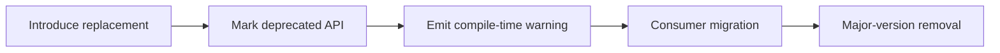

# Deprecation Policy

This policy defines current deprecation handling for public APIs.

## Lifecycle Flow

## Policy Rules

- A replacement API must exist before deprecation is introduced.
- Deprecated APIs must include `since` metadata and migration notes.
- Deprecated APIs remain thin delegates only.
- Removal occurs only on a major version boundary.

## Enforcement

- CI/lint gate for production targets:
  - `cargo clippy --workspace --lib --bins -- -D warnings -D deprecated`
- Backward-compatibility tests can explicitly allow deprecated paths when required.

## Hybrid Host Model

The WASM host contract is deliberately **not** unified: host-push and host-pull coexist, and this is stable policy, not a transition.

- **Host-push stays the default.** The SDK composite (`dist/antikythera-sdk.wasm`) keeps the host-push contract — the host drives `runner` calls and feeds tool results via `process-tool-result-for-session` — and never imports `host-imports`. This path is not scheduled for removal.
- **Host-pull is opt-in and scoped.** The host-pull model exists only for drop-in logic cores that import `host-imports` (world `logic-core-component`, import name `antikythera:agent-sdk/host-imports@1.0.0`). A component that does not import it remains host-push and valid.
- **Permission gating is mandatory.** A host that wires `host-imports` MUST implement the five import functions (`call-llm`, `save-state`, `load-state`, `emit-tool-call`, `log-message`) behind permission gates: call-llm quota, emit-tool-call allowlist, bounded state storage, log passthrough. There is no un-gated mode.
- **Fail-closed.** Without the required permission, the component is rejected — the gate returns an explicit error and no operation proceeds. Un-gated host implementations are not supported and will not be added.

Compatibility commitment: the versioned import name `antikythera:agent-sdk/host-imports@1.0.0` is the contract identity; any change to it follows the deprecation lifecycle above (replacement first, `since` metadata, migration notes, major-version removal).

## Current Deprecations

_No active deprecations. The WASM surface is single-format `wasm32-wasip2` via `component` + `jco`._
