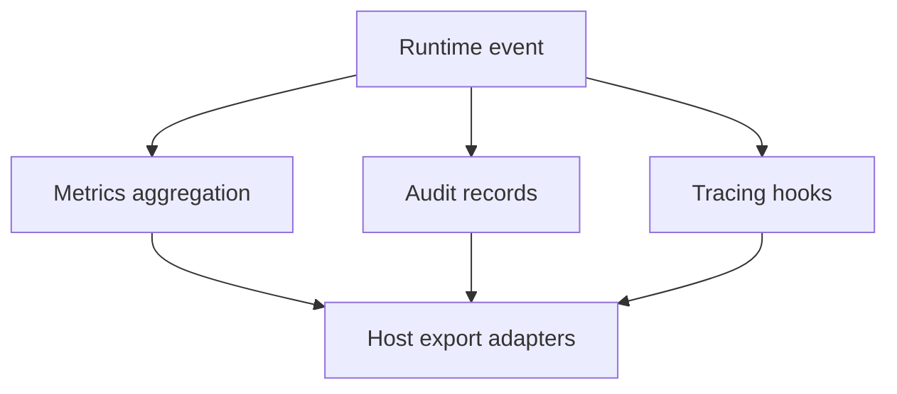

# Observability

This document describes the active observability model used by runtime and host integrations.

## Signal Pipeline



## Crate Structure

### Port Traits (`src/antikythera-ports`)

```
antikythera-ports/src/observability/
+-- mod.rs      # Port trait definitions
```

### Concrete Implementations (`src/antikythera-observability`)

```
antikythera-observability/src/
+-- facade.rs           # ObservabilityFacade combining all subsystems
+-- metrics/            # In-memory metrics exporter
+-- audit/              # Audit trail records
+-- tracing/            # Tracing hooks
+-- telemetry.rs        # Telemetry events
+-- error.rs            # Error types
```

## Current Signals

- Latency summaries and operational counters (`LatencySummary`, `MetricRecord`).
- Structured audit trail records for policy and tool decisions (`AuditRecord`, `AuditTrail`).
- Correlation-ID aware event propagation (`TelemetryEvent`).
- Host-facing export points for external telemetry systems (`MetricsExporter`, `TracingHook`).

## Feature Flags

| Flag | Purpose | Status |
|:-----|:--------|:-------|
| `memory` | In-memory metrics and audit (default) | Stable |
| `full` | Alias for `memory` | Stable |

## Validation

- Use `tests/observability/observability_tests.rs` for behavior checks.
- Keep metric naming stable across minor updates.
