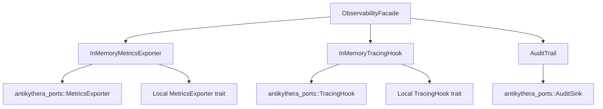

# Observability Crate

Concrete observability implementations for the Antikythera Agent SDK.

## Overview

`antikythera-observability` provides in-memory implementations of the observability port traits defined in `antikythera-ports`. It migrates the observability implementations from `antikythera-core` into a reusable, feature-gated workspace crate.

## Architecture



## Features

- **Metrics** — Counter, gauge, histogram with in-memory storage; latency percentile tracking (p50/p95/p99)
- **Tracing** — Span lifecycle tracking with trace/span IDs and status
- **Audit** — Structured audit trail with category filtering and detail records
- **Telemetry** — `CallerContext` and `TelemetryEvent` re-exported from `antikythera-domain`

## Feature Flags

| Flag | Purpose | Default |
|:-----|:--------|:--------|
| `memory` | In-memory backends for all signals | ✅ |
| `full` | All features enabled | ❌ |

## Usage

```rust
use antikythera_observability::ObservabilityFacade;

let facade = ObservabilityFacade::from_config()?;

// Record a metric
let metrics = facade.metrics().unwrap();
metrics.record_metric("tool.calls", "counter", 1.0, vec![]).await;

// Start a tracing span
let tracer = facade.tracer().unwrap();
let span_id = tracer.start_span("tool_call", vec![]).await;
tracer.end_span(&span_id, "ok").await;

// Record an audit event
let audit = facade.audit().unwrap();
audit.record_event("policy_decision", "allow:model:gpt-4", true, vec![]).await;
```

## Dual Trait Implementation

`InMemoryMetricsExporter` and `InMemoryTracingHook` implement both:
- **Local sync trait** — for backward compatibility with `antikythera-core` internal usage
- **Port async trait** — for compliance with `antikythera-ports` contract

This ensures existing code continues to work while new code can use the standardized port traits.

## Migration from Core

If you were using `antikythera_core::application::observability` types directly:

| Old Import | New Import |
|:-----------|:-----------|
| `antikythera_core::application::observability::InMemoryMetricsExporter` | `antikythera_observability::InMemoryMetricsExporter` |
| `antikythera_core::application::observability::InMemoryTracingHook` | `antikythera_observability::InMemoryTracingHook` |
| `antikythera_core::application::observability::AuditTrail` | `antikythera_observability::AuditTrail` |
| `antikythera_core::application::observability::CallerContext` | `antikythera_observability::CallerContext` |
| `antikythera_core::application::observability::TelemetryEvent` | `antikythera_observability::TelemetryEvent` |

## Testing

```bash
cargo test -p antikythera-tests --test observability_crate_metrics_tests
cargo test -p antikythera-tests --test observability_crate_tracing_tests
cargo test -p antikythera-tests --test observability_crate_audit_tests
cargo test -p antikythera-tests --test observability_crate_facade_tests
cargo test -p antikythera-tests --test observability_crate_telemetry_tests
```
