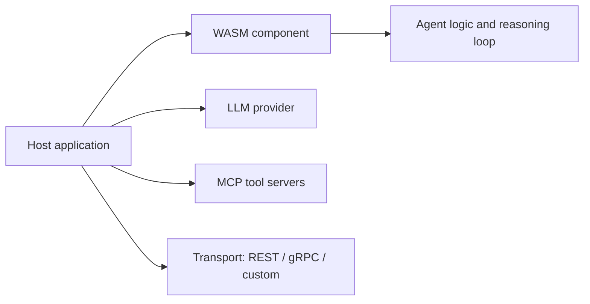

# Product Scope

This document defines what the Antikythera Agent SDK is, what deployment targets it supports, and what surfaces its public API exposes.

## What it is

Antikythera is a **Rust-based MCP client framework** designed to:

- prepare and process LLM message flows while leaving the actual model API call to the embedding host
- connect to MCP tool servers over STDIO and HTTP transports
- run agent and tool-calling flows with structured step management
- expose agent logic as a portable **server-side WASM component** (wasm32-wasip1)
- support multiple LLM providers (Ollama, OpenAI, Gemini) via feature-gated facade

No C FFI is provided by the framework. The SDK core crates do not embed an HTTP server — the Runtime Bridge ships one as a separate deployment binary (`antikythera-server-runtime`, HTTP + SSE). Browser WASM is supported through the **WASI component transpiled with jco** (`npm/antikythera-sdk/component/`, namespace `runner`); the wasm-bindgen browser path is legacy only. A host that embeds the WASM component is responsible for its own transport layer (REST, gRPC, WebSocket, or custom) — or reuses the Runtime Bridge wire protocol (`WIRE_PROTOCOL.md`).

## Deployment targets

| Target | Build command | Output |
|:-------|:-------------|:-------|
| **Framework crates** | `cargo build --workspace` | Library crates |
| **Server-side WASM component** (composite) | `task build` — SDK + toolrunner + default-hooks components + `wasm-tools compose` → `dist/antikythera-sdk.wasm` | `.wasm` component (exports `runner`; imports exactly one non-WASI interface — `runtime-hooks` — plus WASI) |
| **Browser JS bindings** | `npx jco transpile dist/antikythera-sdk.wasm --out-dir npm/antikythera-sdk/component` | ESM module (namespace `runner`) |

No C FFI is provided by the framework. The SDK core crates do not embed an HTTP server — the Runtime Bridge ships one as a separate deployment binary (`antikythera-server-runtime`, HTTP + SSE). Browser WASM is supported through the **WASI component transpiled with jco** (`npm/antikythera-sdk/component/`, namespace `runner`); the wasm-bindgen browser path is legacy only. A host that embeds the WASM component is responsible for its own transport layer (REST, gRPC, WebSocket, or custom) — or reuses the Runtime Bridge wire protocol (`WIRE_PROTOCOL.md`).

## Public SDK surface

The `antikythera-sdk` crate provides the stable integration surface:

| Area | Key types |
|:-----|:---------|
| Client and config | `AppConfig`, `McpClient`, `ClientConfig`, `ChatRequest`, `PreparedChatTurn` |
| Agent infrastructure | `Agent`, `AgentOptions`, `AgentOutcome`, `ToolDescriptor` |
| Host model delegation | `DynamicModelProvider`, `ModelProvider`, `HostModelClient`, `HostModelTransport` |
| Multi-agent | `MultiAgentOrchestrator`, `AgentProfile`, `AgentTask` |
| Routing strategies | `DirectRouter`, `RoundRobinRouter`, `FirstAvailableRouter`, `RoleRouter` |
| Logging | `AgentLogger`, `ChatLogger`, `ConfigLogger`, `DiscoveryLogger`, `OrchestratorLogger`, `ProviderLogger`, `ResilienceLogger`, `SecurityLogger`, `SessionLogger`, `StdioLogger`, `StreamingLogger`, `TransportLogger`, `WasmLogger` |
| Session | Session history types, import/export |

## Public Facade surface

The `antikythera-facade` crate provides a high-level API with provider selection:

| Area | Key types |
|:-----|:---------|
| Simple API | `SimpleAgent`, `SimpleConfig` |
| Provider selection | Feature-gated: `ollama` (default), `openai`, `gemini`, `full` |

## Architecture philosophy

The framework is designed around one principle: **the host owns the interface layer**.

The WASM component handles agent reasoning, session continuity, history shaping, and response parsing. The host handles every external integration: LLM calls, tool execution, persistence, and protocol exposure. This keeps the component portable across runtimes and avoids embedding infrastructure concerns inside the framework.

## Feature flags

### `antikythera-sdk`

| Flag | Purpose | Status |
|:-----|:--------|:-------|
| `component` | Server-side WASM Component Model support (wasm32-wasip1 WASI) — basis untuk server dan browser-via-jco | Active |
| `wasm` | Browser WASM support (wasm32-unknown-unknown), enables `antikythera-log/wasm` — **legacy**, digantikan jalur component + jco | Deprecated |
| `toolrunner` | In-process tool execution via `antikythera-toolrunner` | Active |
| `wasm-sandbox` | Wasmtime-based sandbox execution | Active |

### `antikythera-facade`

| Flag | Purpose | Status |
|:-----|:--------|:-------|
| `ollama` | Ollama LLM provider (default) | Stable |
| `openai` | OpenAI LLM provider | Stable |
| `gemini` | Google Gemini LLM provider | Stable |
| `full` | Enables all three providers | Stable |

### `antikythera-log`

| Flag | Purpose | Status |
|:-----|:--------|:-------|
| `wasm` | Browser-safe time via js-sys (wasm32-unknown-unknown) — **legacy** (digantikan jalur WASI component + jco) | Deprecated |
| `subscriber` | Real-time log streaming via tokio + crossbeam-channel | Stable |
| `lint` | Compile-time lint blocking println!, eprintln!, dbg!, tracing | Stable |

### `antikythera-storage`

| Flag | Purpose | Status |
|:-----|:--------|:-------|
| `filesystem` | JSON file storage backend (default) | Stable |
| `mongodb` | MongoDB backend | Stable |
| `postgres` | PostgreSQL backend | Stable |
| `standalone` | REST API server mode | Stable |
| `sse` | SSE backup service | Stable |
| `wasm` | WASM component integration | Stable |

### `antikythera-observability`

| Flag | Purpose | Status |
|:-----|:--------|:-------|
| `memory` | In-memory metrics and audit (default) | Stable |
| `full` | Alias for `memory` | Stable |

### `antikythera-security`

| Flag | Purpose | Status |
|:-----|:--------|:-------|
| `validation` | Input validation with regex (default) | Stable |
| `rate-limit` | Rate limiting (default) | Stable |
| `memory` | In-memory secrets storage (default) | Stable |
| `full` | Enables all three features | Stable |

### `antikythera-toolrunner`

| Flag | Purpose | Status |
|:-----|:--------|:-------|
| `log` | Enables `antikythera-log` integration | Stable |
| `wasm` | WASM target support | Stable |

### `antikythera-core`

`antikythera-core` has no feature flags. Platform-specific functionality is handled via `cfg(target_arch)` blocks.

## Related documents

- [`ARCHITECTURE.md`](ARCHITECTURE.md) — crate relationships and request flow
- [`BUILD.md`](BUILD.md) — build commands for each target
- [`COMPONENT.md`](COMPONENT.md) — WASM component model details
- [`WASM_AGENT.md`](WASM_AGENT.md) — agent logic inside the component
