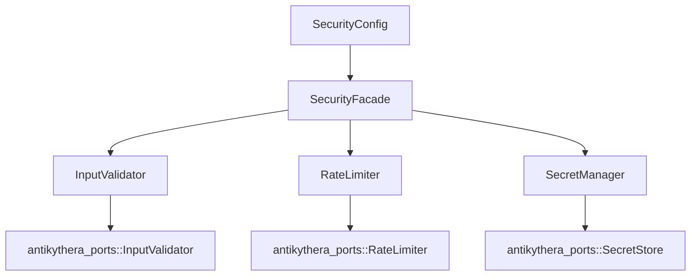

# Security Crate

Concrete security implementations for the Antikythera Agent SDK.

## Overview

`src/antikythera-security` provides production-ready implementations of the security port traits defined in `src/antikythera-ports`. It migrates the security implementations from the example CLI into a reusable, feature-gated workspace crate.

## Architecture



## Features

- **Input Validation** — Size, message length, URL pattern matching, HTML sanitization, JSON structure validation, keyword blocking
- **Rate Limiting** — Sliding window per minute/hour/day, burst allowance, concurrent session limits, background cleanup
- **Secrets Management** — In-memory backend with versioning, rotation, and metadata tracking

## Feature Flags

| Flag | Purpose | Default |
|:-----|:--------|:--------|
| `validation` | Input validation with regex | ✅ |
| `rate-limit` | Rate limiting with sliding window | ✅ |
| `memory` | In-memory secret storage | ✅ |
| `crypto` | AES-256-GCM encryption at rest | ❌ |
| `file-secrets` | File-based secret storage | ❌ |
| `full` | All features enabled | ❌ |

## Usage

```rust
use antikythera_security::SecurityFacade;
use antikythera_domain::security::SecurityConfig;

let facade = SecurityFacade::from_config(SecurityConfig::default())?;

// Validate input
let result = facade.validator.validate_size("user input");

// Check rate limit
facade.rate_limiter.check("session-id")?;

// Store a secret
facade.secret_store.store_secret("api-key", b"secret-value").await?;
```

## Port Trait Compliance

| Port Trait | Implementation |
|:-----------|:---------------|
| `antikythera_ports::InputValidator` | `InputValidator` |
| `antikythera_ports::RateLimiter` | `RateLimiter` |
| `antikythera_ports::SecretStore` | `SecretManager` |

## Testing

```bash
cargo test -p antikythera-tests --test security_crate_validation_tests
cargo test -p antikythera-tests --test security_crate_rate_limit_tests
cargo test -p antikythera-tests --test security_crate_secrets_tests
cargo test -p antikythera-tests --test security_crate_facade_tests
```
