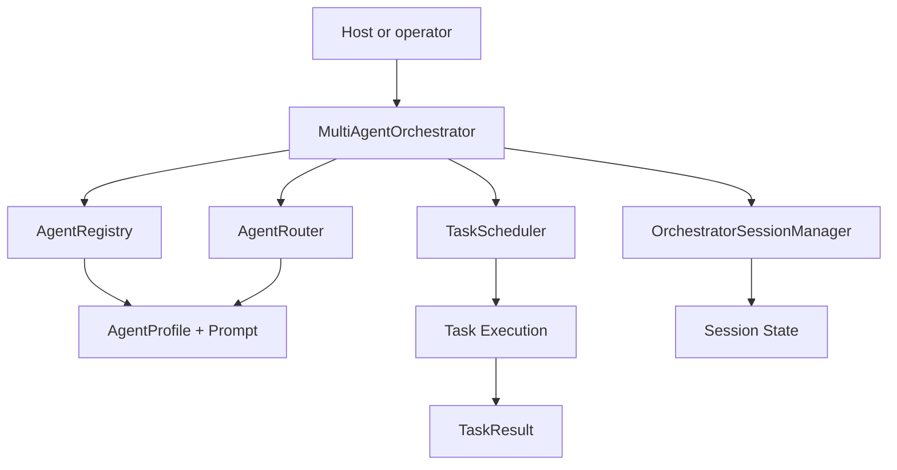

# Servers and Agents

This document summarizes the server and agent management surface exposed by the project documentation.

## Overview

The framework separates:

- server definitions and tool connectivity
- agent definitions and execution behavior
- multi-agent orchestration and session management

## High-level model



## Multi-Agent Orchestration

Multi-agent orchestration is available via `antikythera-sdk`'s `agents` module.

### Agent Setup with Prompts

Each agent has a profile with a system prompt that defines its behavior:

```rust
use antikythera_sdk::AgentProfile;

// Manual setup
let coder = AgentProfile::new("coder", "Code Writer", "code")
    .with_system_prompt("You are an expert programmer. Write clean, efficient code.")
    .with_max_steps(10);

// Built-in role templates
let reviewer = AgentProfile::for_role("reviewer");
let analyst = AgentProfile::for_role("analyst");
let researcher = AgentProfile::for_role("researcher");
```

**Built-in roles:**

| Role | ID | System Prompt |
|:-----|:---|:-------------|
| `coder` | `coder` | "You are an expert software engineer. Write clean, efficient, and well-documented code." |
| `reviewer` | `reviewer` | "You are an expert code reviewer. Analyze code for bugs, security issues, and style violations." |
| `analyst` | `analyst` | "You are a data analyst. Analyze data, identify patterns, and provide actionable insights." |
| `researcher` | `researcher` | "You are a thorough researcher. Gather information, verify facts, and synthesize findings." |

### Multi-Session Management

The orchestrator manages sessions across agents automatically:

```rust
use antikythera_sdk::{MultiAgentOrchestrator, OrchestratorSessionManager};

let session_manager = OrchestratorSessionManager::new()
    .with_max_sessions(50)
    .with_session_ttl(Duration::from_secs(3600));

let orchestrator = MultiAgentOrchestrator::new(client, ExecutionMode::Auto)
    .with_session_manager(session_manager);

// Sessions are tracked automatically per task
let task = AgentTask::new("Review this code")
    .with_session_id("session-123");
let result = orchestrator.dispatch(task).await;

// Query sessions
let sessions = orchestrator.sessions().list_by_agent("reviewer");
```

### Orchestration API

```rust
use antikythera_sdk::{
    MultiAgentOrchestrator, AgentProfile, AgentTask,
    ExecutionMode, OrchestratorBudget,
};

// Build orchestrator with agents
let mut orch = MultiAgentOrchestrator::new(client, ExecutionMode::Auto)
    .register_agent(AgentProfile::for_role("coder"))
    .register_agent(AgentProfile::for_role("reviewer"))
    .with_budget(OrchestratorBudget::new()
        .with_max_concurrent_tasks(4)
        .with_max_total_steps(100));

// Single task dispatch
let result = orch.dispatch(AgentTask::new("Write a sorting algorithm")).await;

// Batch dispatch
let results = orch.dispatch_many(vec![
    AgentTask::new("Task 1"),
    AgentTask::new("Task 2"),
]).await;

// Pipeline (sequential with output chaining)
let pipeline = orch.pipeline(vec![
    AgentTask::new("Write code"),
    AgentTask::new("Review the code"),
]).await;
```

## Runtime hardening controls (host-facing)

For multi-agent orchestration, host code can now manipulate and monitor
hardening state at runtime via SDK helpers in `antikythera-sdk::agents`.

| API | Purpose |
|:----|:--------|
| `configure_hardening(options_json)` | Apply max concurrency/task/step limits, default retry condition, and optional guardrail JSON config |
| `cancel_orchestrator()` | Trigger cooperative cancellation for active orchestration |
| `get_monitor_snapshot()` | Return live monitor snapshot JSON (budget + cancellation state) |
| `task_result_detail(task_result_json)` | Decode task metadata and error/routing detail without manual field mapping |

`options_json` now also accepts an optional `guardrails` object. Example:

```json
{
    "max_concurrent_tasks": 4,
    "default_retry_condition": "on_transient",
    "guardrails": {
        "timeout": {
            "max_timeout_ms": 2000,
            "require_explicit_timeout": true
        },
        "budget": {
            "max_task_steps": 8,
            "require_explicit_budget": true
        },
        "rate_limit": {
            "max_tasks": 10,
            "window_ms": 60000
        },
        "cancellation": true
    }
}
```

The decoded `task_result_detail(...)` payload now includes optional
`guardrail_name` and `guardrail_stage` fields when a guardrail rejected a task.

## Guardrail System

Built-in guardrails protect against common failure modes:

| Guardrail | What it checks |
|:----------|:---------------|
| `TimeoutGuardrail` | Rejects tasks without explicit timeout (optional), or with timeout exceeding max |
| `BudgetGuardrail` | Enforces per-task and orchestrator-wide step budgets |
| `RateLimitGuardrail` | Rolling-window rate limiting per orchestrator |
| `CancellationGuardrail` | Blocks tasks when orchestrator is cancelled |

```rust
use antikythera_sdk::GuardrailChain;

let guardrails = GuardrailChain::new()
    .with_guardrail(Arc::new(TimeoutGuardrail::new(
        TimeoutGuardrailConfig { max_timeout_ms: 5000, require_explicit_timeout: true }
    )));
```

## Host integration hooks

Core now also exposes host hook middleware in `antikythera_core::application::hooks`
for auth, correlation, policy, and telemetry integration. See [`HOOKS.md`](HOOKS.md).

The WIT `multi-agent-runner` contract mirrors these operations through
`configure-hardening`, `cancel-orchestrator`, `get-monitor-snapshot`, and
`task-result-detail`.

## Native streaming pipeline

Host applications that implement native streaming can emit events while parsing provider
chunked responses:

1. provider stream payload is parsed chunk-by-chunk,
2. each chunk emits a stream event in the LLM pipeline,
3. terminal sink prints chunks live to stderr so stdout remains protocol-safe.

This keeps interactive visibility in CLI mode while preserving structured
stdout output (for JSON or automation consumers). The example CLI enables the terminal stream sink with the `--stream` flag.

## Related documents

- [`STREAMING.md`](STREAMING.md)
- [`WASM_AGENT.md`](WASM_AGENT.md)
- [`COMPONENT.md`](COMPONENT.md)
- [`HOOKS.md`](HOOKS.md)
