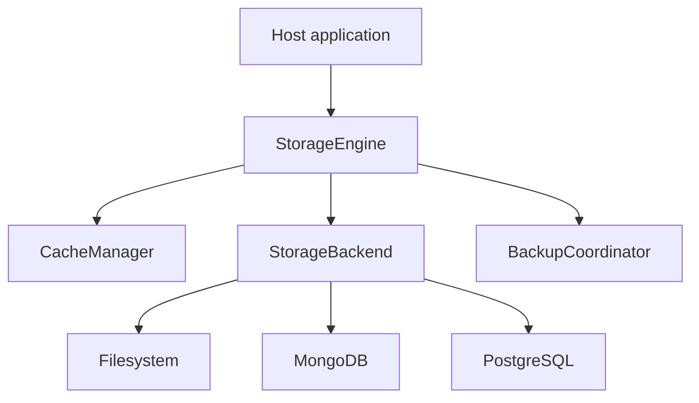

# Storage

This document describes the `antikythera-storage` crate — the session persistence layer for the Antikythera MCP Framework.

## Overview



## Architecture

| Component | Responsibility |
|:----------|:---------------|
| `StorageEngine` | High-level coordinator tying backend, cache, and backup |
| `StorageBackend` | Trait for pluggable storage backends |
| `CacheManager` | In-memory cache with TTL + LRU eviction |
| `BackupCoordinator` | Manages backup lifecycle and sync |
| `BackupScheduler` | Periodic sync of backups to primary storage |
| `BackupVerifier` | Ensures DB success before file deletion |

## Storage Backends

### Filesystem (default)

Sessions stored as JSON files at `{data_dir}/{session_id}.json`.

```toml
[storage]
backend = "filesystem"
data_dir = "./data/sessions"
backup_dir = "./data/backups"
```

### MongoDB

Sessions stored as documents with binary data. Supports automatic schema creation.

```toml
[storage]
backend = "mongodb"

[storage.mongodb]
uri = "mongodb://localhost:27017"
database = "antikythera"
collection = "sessions"
auto_create_schema = true
```

### PostgreSQL

Sessions stored in a `sessions` table with JSONB data column. Supports automatic schema creation.

```toml
[storage]
backend = "postgres"

[storage.postgres]
host = "localhost"
port = 5432
database = "antikythera"
user = "postgres"
password = ""
auto_create_schema = true
```

Schema created automatically on first connect:

```sql
CREATE TABLE IF NOT EXISTS sessions (
    id VARCHAR(36) PRIMARY KEY,
    data JSONB NOT NULL,
    created_at TIMESTAMPTZ DEFAULT NOW(),
    updated_at TIMESTAMPTZ DEFAULT NOW()
);
```

## Deployment Modes

| Mode | Description |
|:-----|:------------|
| `embedded` | Storage compiled into WASM, uses WASI filesystem |
| `standalone` | Storage runs as separate REST server |

## Cache Configuration

```toml
[storage.cache]
enabled = true
max_sessions = 512
ttl_seconds = 3600
eviction_policy = "both"  # lru | ttl | both
```

| Policy | Behavior |
|:-------|:---------|
| `lru` | Evict least-recently-used when capacity reached |
| `ttl` | Evict entries that exceed idle time |
| `both` | Apply both LRU and TTL eviction |

## Backup Configuration

```toml
[storage.backup]
enabled = true
mode = "realtime"           # realtime | interval
sync_interval_seconds = 30
verify_before_delete = true
```

| Mode | Behavior |
|:-----|:---------|
| `realtime` | Backup immediately on each save |
| `interval` | Batch backups, sync to DB at configured interval |

For SQL backends, backups are first written to filesystem, then synced to DB. The system ensures DB success before deleting the backup file.

## Host Integration

Host applications enable storage initialization with the `--storage` flag:

```bash
# Example CLI usage
antikythera --storage

# With custom config path
antikythera --storage --config /path/to/app.toml
```

## REST API (standalone mode)

When `mode = "standalone"`, storage exposes HTTP endpoints:

| Method | Endpoint | Description |
|:-------|:---------|:------------|
| GET | `/api/sessions` | List all sessions |
| GET | `/api/sessions/:id` | Get session by ID |
| POST | `/api/sessions/:id` | Save session |
| DELETE | `/api/sessions/:id` | Delete session |
| GET | `/api/health` | Health check |

## SSE Backup Service

A separate microservice for independent backup processing:

```toml
[storage.sse_backup]
enabled = true
bind = "0.0.0.0:8081"
core_url = "http://127.0.0.1:8080"
```

## Feature Flags

| Feature | Description |
|:--------|:------------|
| `filesystem` (default) | JSON file storage backend |
| `mongodb` | MongoDB backend |
| `postgres` | PostgreSQL backend |
| `standalone` | REST API server mode |
| `sse` | SSE backup service |
| `wasm` | WASM component integration |

## Module Structure

```text
antikythera-storage/src/
├── lib.rs              # StorageEngine coordinator
├── error.rs            # StorageError enum
├── config.rs           # StorageConfig types
├── backend/
│   ├── mod.rs          # StorageBackend trait
│   ├── filesystem.rs   # JSON file backend
│   ├── mongodb.rs      # MongoDB backend
│   └── postgres.rs     # PostgreSQL backend
├── cache/
│   ├── mod.rs          # CacheManager
│   └── entry.rs        # CacheEntry
├── backup/
│   ├── mod.rs          # BackupCoordinator
│   ├── scheduler.rs    # Periodic sync
│   └── verifier.rs     # DB verification
├── api/                # REST API (feature: standalone)
├── sse/                # SSE service (feature: sse)
├── wasm/               # WASM integration (feature: wasm)
└── schema/             # DB schema management
```

## Related documents

- [`CONFIG.md`](CONFIG.md) for full configuration reference
- [`CACHE.md`](CACHE.md) for cache behavior details
- [`CLI.md`](CLI.md) for example CLI usage
- [`ARCHITECTURE.md`](ARCHITECTURE.md) for system-level design
