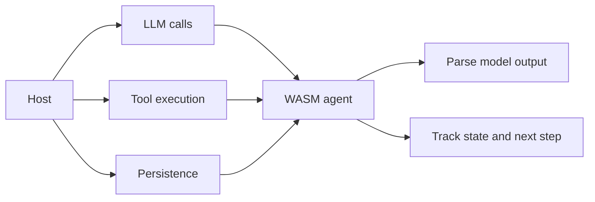

# WASM Agent

This document describes the WASM-side agent model at a high level.

## Overview

The WASM agent focuses on agent logic and response processing, while the host side handles external I/O.

## Responsibility split

## Why this split matters

| WASM side | Host side |
|:----------|:----------|
| Agent reasoning loop | External API calls |
| Response parsing | Tool execution |
| Step management | Persistence and environment integration |

## Benefits

- Keeps the WASM side smaller and more portable
- Lets the host choose provider and infrastructure strategy
- Avoids embedding every I/O concern into the component itself

## Pipeline customization

The pipeline can be customized via composed `logic-hooks` components without changing the SDK: `prepare-turn`, `decide-action`, and `handle-tool-result` run as stateless decision points that passthrough, override, or abort. Session state stays with the SDK — hooks receive it as input and never persist. See [`WASM_ARCHITECTURE.md`](WASM_ARCHITECTURE.md) — Logic hooks.

## Hybrid host model

The WASM agent ships in two shapes with different host contracts:

- **Host-push (SDK composite)** — the host drives the exported `runner` functions and feeds tool results back via `process-tool-result-for-session`. The composite never imports `host-imports`.
- **Host-pull (drop-in logic core)** — a logic core that imports `host-imports` calls the host for LLM, state, tool execution, and logging (`call-llm`, `save-state`, `load-state`, `emit-tool-call`, `log-message`). The host MUST implement the import behind permission gates (quota, allowlist, bounded storage, log passthrough); without permission the component is rejected (fail-closed).

Both shapes export the same `runner` interface, so host code calls the same API either way. See [`WASM_ARCHITECTURE.md`](WASM_ARCHITECTURE.md) — Host-imports (activated for drop-in logic cores).

## Message and session flow

The intended host/WASM exchange is:

1. The first host request may contain only plain user text.
2. The framework creates or continues a `session_id` and assembles the internal message history.
3. The framework emits a prepared message list for the host to send to the LLM.
4. The host calls the provider API and may return either:
    - plain text, or
    - a structured assistant message already shaped to match framework expectations.
5. The framework records that assistant turn into history so the next prepared request remains tied to the same WASM-side context.

This allows the host to own provider-specific payload shaping while the framework owns conversation continuity, step tracking, and response interpretation.

## Session archive and restore flow

The runner supports automatic in-memory pressure handling and idle timeout archival.

### Triggers

- Capacity pressure: session count exceeds `max_in_memory_sessions`
- Inactive timeout: `sweep_idle_sessions(...)` finds sessions older than `session_timeout_secs`

### What the runner emits

When a session leaves RAM, the event stream includes:

- `session_archived`
    - includes `reason` (`capacity_pressure` or `idle_timeout`)
    - includes `state_json` snapshot to persist in host storage

If a request arrives for an archived session, the runner emits:

- `session_restore_requested`
- `session_restore_progress` (initial stage)

After host loads state from durable storage, it restores RAM state via:

- `init(config_json)` with the session ID to recreate the session

This flow allows hosts to stream loading feedback to user interfaces when restore latency is non-trivial.

## Exported WASM functions

The WASM component exports the following host-callable functions:

| Function | Purpose |
|:---------|:--------|
| `init(config_json)` | Initialize/configure runtime with session ID and defaults |
| `prepare_user_turn(request_json)` | Prepare messages for LLM call |
| `append_llm_chunk(session_id, chunk, correlation_id?)` | Stream LLM token chunks |
| `commit_llm_response(prepared_turn_json, llm_response_json)` | Commit full LLM response |
| `commit_llm_stream(prepared_turn_json)` | Commit streamed LLM response |
| `process_llm_response_for_session(session_id, llm_response_json)` | Process LLM response without prepared turn |
| `process_tool_result_for_session(session_id, tool_result_json)` | Process tool execution result |
| `drain_events(session_id)` | Drain pending telemetry events |
| `get_state(session_id)` | Get session state as JSON |
| `get_telemetry_snapshot(session_id)` | Get telemetry counters |
| `get_slo_snapshot(session_id)` | Get SLO latency snapshot |
| `get_tools_prompt()` | Get formatted tool list for system prompt |
| `register_tools(tools_json)` | Register MCP tool definitions |
| `set_context_policy(policy_json)` | Update context management policy |
| `reset_session(session_id)` | Reset/remove a session |
| `sweep_idle_sessions(now_unix_ms?)` | Trigger idle timeout sweep manually |

The table above uses the Rust/WIT naming (snake_case). When the component is transpiled with jco for the browser, the same functions are exposed on the `runner` namespace with camelCase names (e.g. `prepareUserTurn`, `getState`, `sweepIdleSessions`) — see [`WASM_ARCHITECTURE.md`](WASM_ARCHITECTURE.md).

## Related documents

- [`COMPONENT.md`](COMPONENT.md)
- [`JSON_SCHEMA.md`](JSON_SCHEMA.md)
