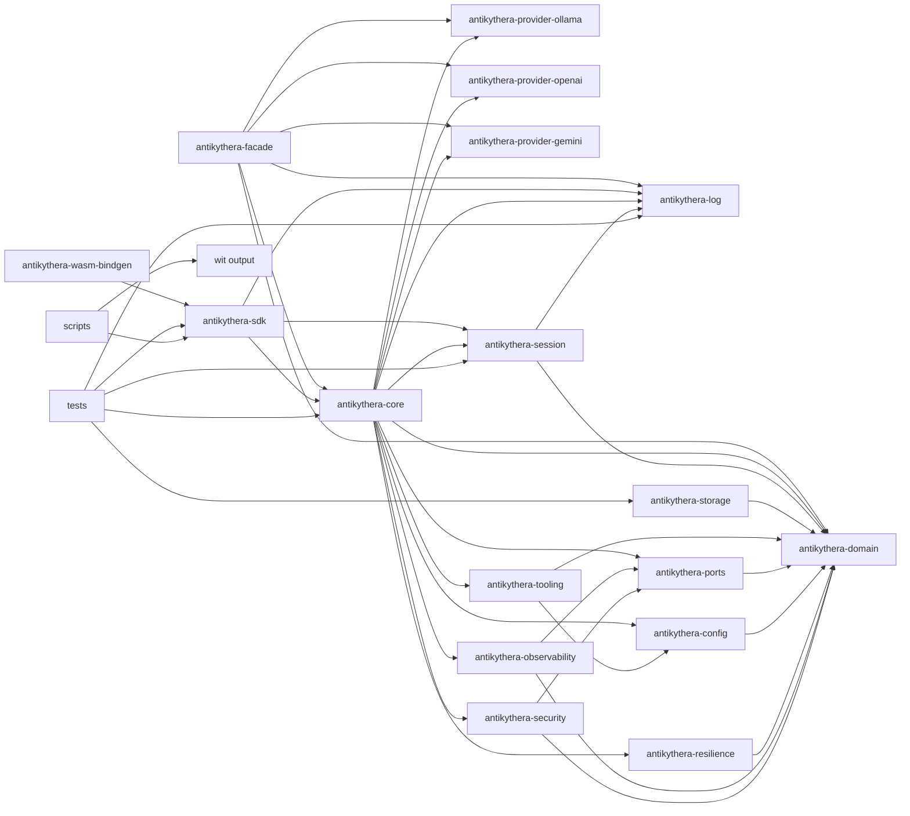

# Workspace

This document explains how the repository is organized and how each crate relates to the others.

## Repository map

```mermaid
flowchart TD
    ROOT[antikythera-agent-sdk]
    ROOT --> DOMAIN[antikythera-domain]
    ROOT --> PORTS[antikythera-ports]
    ROOT --> CONFIG[antikythera-config]
    ROOT --> LOG[antikythera-log]
    ROOT --> RESILIENCE[antikythera-resilience]
    ROOT --> TOOLING[antikythera-tooling]
    ROOT --> OBSERVABILITY[antikythera-observability]
    ROOT --> SECURITY[antikythera-security]
    ROOT --> STORAGE[antikythera-storage]
    ROOT --> SESSION[antikythera-session]
    ROOT --> CORE[antikythera-core]
    ROOT --> PROVIDER_OLLAMA[antikythera-provider-ollama]
    ROOT --> PROVIDER_OPENAI[antikythera-provider-openai]
    ROOT --> PROVIDER_GEMINI[antikythera-provider-gemini]
    ROOT --> SDK[antikythera-sdk]
    ROOT --> FACADE[antikythera-facade]
    ROOT --> WASM_BINDGEN[antikythera-wasm-bindgen]
    ROOT --> TOOLRUNNER[antikythera-toolrunner]
    ROOT --> TESTS[tests]
    ROOT --> SCRIPTS[scripts]
    ROOT --> EXAMPLES[examples]
    ROOT --> DOCS[documentation]
```

## Crate responsibilities

### Layer 0: Types

| Path | Role |
|:-----|:-----|
| `antikythera-domain/` | Canonical domain types (entities, sessions, FSM, validation) — zero internal deps |
| `antikythera-ports/` | Port trait definitions (hexagonal architecture) — depends on domain |

### Layer 1: Implementations

| Path | Role |
|:-----|:-----|
| `antikythera-config/` | Configuration schema and loading — depends on domain |
| `antikythera-log/` | Structured logging and subscriptions — standalone |
| `antikythera-resilience/` | Retry, timeout, context window, and health tracking — depends on domain |
| `antikythera-tooling/` | MCP tool server management — depends on domain, config |
| `antikythera-observability/` | In-memory observability implementations — depends on domain, ports |
| `antikythera-security/` | Validation, rate limiting, secrets management — depends on domain, ports |
| `antikythera-storage/` | Session persistence with pluggable backends — depends on domain |

### Layer 2: Core

| Path | Role |
|:-----|:-----|
| `antikythera-core/` | Core MCP runtime, agent logic, transports — depends on domain, ports, config, log, resilience, tooling, observability |
| `antikythera-session/` | Session management with persistent chat history — depends on domain, log |

### Layer 3: Providers

| Path | Role |
|:-----|:-----|
| `antikythera-provider-ollama/` | Ollama LLM provider — depends on domain, core |
| `antikythera-provider-openai/` | OpenAI LLM provider — depends on domain, core |
| `antikythera-provider-gemini/` | Google Gemini LLM provider — depends on domain, core |

### Layer 4: SDK & Facade

| Path | Role |
|:-----|:-----|
| `antikythera-sdk/` | Public API layer for Rust and WASM component bindings — depends on core, log, session |
| `antikythera-facade/` | High-level API with provider selection (Ollama/OpenAI/Gemini) — depends on core, domain, log |

### Layer 5: Deployment

| Path | Role |
|:-----|:-----|
| `plugin/antikythera-wasm-bindgen/` | wasm-bindgen bindings for browser WASM targets — depends on SDK |
| `plugin/antikythera-toolrunner/` | In-process tool execution — standalone |

### Supporting directories

| Path | Role |
|:-----|:-----|
| `tests/` | Workspace integration tests and scenario coverage |
| `scripts/` | WIT generation and component build helpers |
| `wit/` | Generated WIT output |
| `documentation/` | Focused guides and references |
| `examples/chat` | Rust chat example using antikythera-facade |
| `examples/antikythera-web` | TypeScript/Vite web frontend (not a workspace member) |

## Workspace dependency shape

## Practical reading order

1. Start with `antikythera-domain` to understand the canonical types.
2. Move to `antikythera-ports` to see the port/adapter trait definitions.
3. Check `antikythera-core` to understand the runtime behavior.
4. Move to `antikythera-sdk` to see the public API and bindings layer.
5. Check `antikythera-facade` to see the high-level API with provider selection.
6. Use `tests/` to see how the repository is exercised end-to-end.
