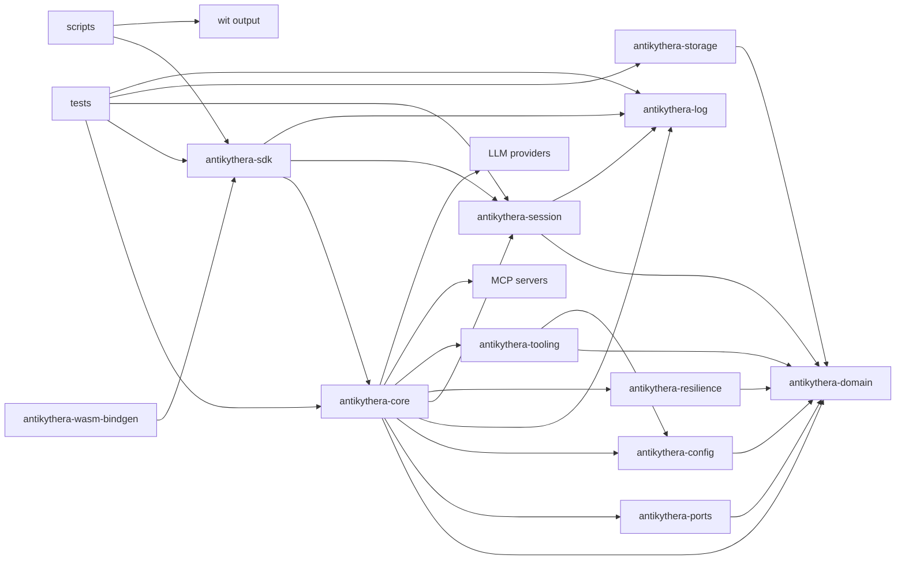

# Workspace

This document explains how the repository is organized and how each crate relates to the others.

## Repository map

```mermaid
flowchart TD
    ROOT[antikythera-agent-sdk]
    ROOT --> DOMAIN[antikythera-domain]
    ROOT --> PORTS[antikythera-ports]
    ROOT --> CONFIG[antikythera-config]
    ROOT --> RESILIENCE[antikythera-resilience]
    ROOT --> LOG[antikythera-log]
    ROOT --> SESSION[antikythera-session]
    ROOT --> STORAGE[antikythera-storage]
    ROOT --> TOOLING[antikythera-tooling]
    ROOT --> CORE[antikythera-core]
    ROOT --> SDK[antikythera-sdk]
    ROOT --> WASM_BINDGEN[antikythera-wasm-bindgen]
    ROOT --> TESTS[tests]
    ROOT --> SCRIPTS[scripts]
    ROOT --> EXAMPLES[example]
    ROOT --> DOCS[documentation]
```

## Crate responsibilities

### Framework crates (workspace members)

| Path | Role |
|:-----|:-----|
| `antikythera-domain/` | Canonical domain types (entities, sessions, FSM, validation) — zero internal deps |
| `antikythera-ports/` | Port trait definitions (hexagonal architecture) — depends on domain |
| `antikythera-config/` | Configuration schema and loading — depends on domain |
| `antikythera-resilience/` | Retry, timeout, context window, and health tracking — depends on domain |
| `antikythera-log/` | Structured logging and subscriptions — standalone |
| `antikythera-session/` | Session data model, history, and export/import — depends on domain, log |
| `antikythera-storage/` | Session persistence with pluggable backends — depends on domain |
| `antikythera-tooling/` | MCP tool server management — depends on domain, config |
| `antikythera-core/` | Core MCP runtime, agent logic, transports — depends on domain, ports, config, log, resilience, tooling |
| `antikythera-sdk/` | Public API layer for Rust and WASM component bindings — depends on core, log, session |
| `antikythera-wasm-bindgen/` | wasm-bindgen bindings for browser WASM targets |

### Example applications (not workspace members)

| Path | Role |
|:-----|:-----|
| `example/antikythera-cli/` | Interactive CLI client — reference implementation for building host applications |
| `example/antikythera-web/` | Web frontend (Vue.js/TypeScript) |

### Supporting directories

| Path | Role |
|:-----|:-----|
| `tests/` | Workspace integration tests and scenario coverage |
| `scripts/` | WIT generation and component build helpers |
| `wit/` | Generated WIT output |
| `documentation/` | Focused guides and references |

## Workspace dependency shape

## Practical reading order

1. Start with `antikythera-domain` to understand the canonical types.
2. Move to `antikythera-ports` to see the port/adapter trait definitions.
3. Check `antikythera-core` to understand the runtime behavior.
4. Move to `antikythera-sdk` to see the public API and bindings layer.
5. Use `example/antikythera-cli` as a reference for building host applications.
6. Use `tests/` to see how the repository is exercised end-to-end.
